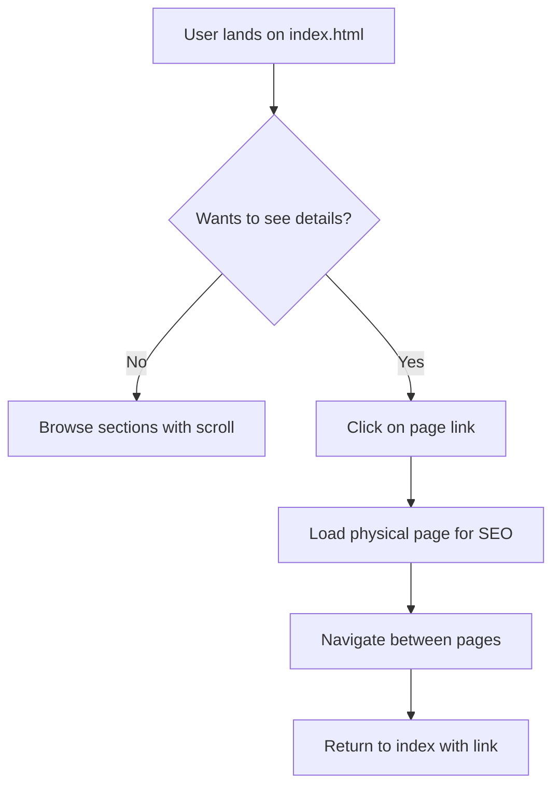
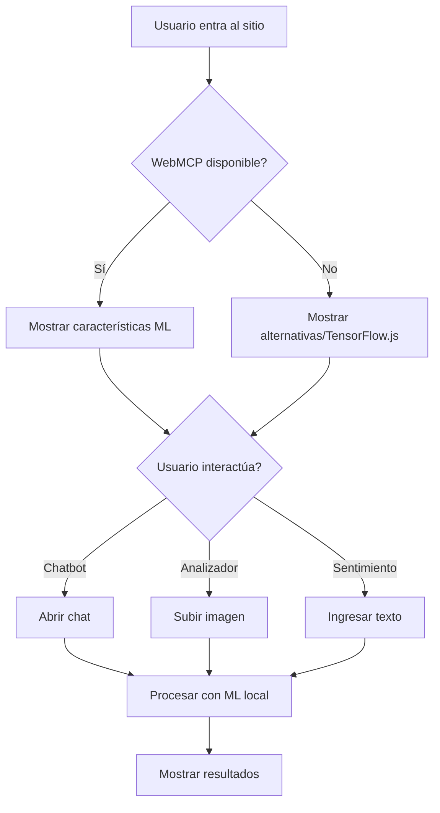

# Site Structure - Aniwa Digital Marketing

## Overview

Hybrid website: single-page experience with smooth navigation, but with separate pages (unique URLs) for SEO.

## File and Folder Structure

```
beaniwa.com/
├── index.html              # Página principal (SPA entry point)
├── pages/                  # Páginas físicas para SEO
│   ├── index.html          # Página de inicio (redirige a #inicio)
│   ├── servicios.html      # Página de servicios
│   ├── portafolio.html     # Página de portafolio
│   ├── nosotros.html       # Página de nosotros
│   └── contacto.html       # Página de contacto
├── css/
│   └── styles.css          # Estilos globales
├── js/
│   ├── main.js             # Punto de entrada
│   ├── router.js           # Sistema de routing SPA
│   ├── navigation.js       # Lógica de navegación
│   ├── scroll.js           # Scroll suave y navegación fija
│   └── components/         # Componentes JS
│       ├── header.js
│       ├── mobile-menu.js
│       └── scroll-animations.js
├── assets/
│   ├── images/
│   ├── icons/
│   └── fonts/
├── pages/                  # Páginas en español
│   ├── index.html
│   ├── servicios.html
│   ├── portafolio.html
│   ├── nosotros.html
│   └── contacto.html
└── en/                     # Páginas en inglés
    └── pages/
        ├── index.html
        ├── services.html
        ├── portfolio.html
        ├── about.html
        └── contact.html
```

## Page/Section Definition

### 1. Main Page (index.html)
- **URL**: `/` and `/index.html`
- **Sections**: Hero, Services (preview), Portfolio (preview), About Us (preview), Contact
- **Purpose**: Main landing with smooth navigation

### 2. Services Page (/pages/servicios.html)
- **URL**: `/servicios.html`
- **Title SEO**: "Digital Marketing Services | Aniwa"
- **Description SEO**: "Discover our digital marketing services, social media advertising, web design and more."
- **Content**: Complete list of services with details

### 3. Portfolio Page (/pages/portafolio.html)
- **URL**: `/portafolio.html`
- **Title SEO**: "Project Portfolio | Aniwa"
- **Description SEO**: "Explore our digital marketing success stories and projects."
- **Content**: Project galleries, case studies

### 4. About Us Page (/pages/nosotros.html)
- **URL**: `/nosotros.html`
- **Title SEO**: "About Us | Aniwa - Digital Marketing Agency"
- **Description SEO": "Meet the team behind Aniwa. Digital marketing experts."
- **Content**: Company history, team, values, mission, vision

### 5. Contact Page (/pages/contacto.html)
- **URL**: `/contacto.html`
- **Title SEO**: "Contact | Aniwa - Get a Quote"
- **Description SEO**: "Contact us to triple your sales. Write to us now."
- **Content**: Contact form, contact information

## Navigation System

### Estructura del Header
```
<header class="header">
  <nav class="nav">
    <a href="/" class="logo">Aniwa</a>
    <ul class="nav-menu">
      <li><a href="/#inicio">Inicio</a></li>
      <li><a href="/pages/servicios.html">Servicios</a></li>
      <li><a href="/pages/portafolio.html">Portafolio</a></li>
      <li><a href="/pages/nosotros.html">Nosotros</a></li>
      <li><a href="/pages/contacto.html">Contacto</a></li>
    </ul>
  </nav>
</header>
```

### Navigation Logic
- **Internal links (#section)**: Smooth scroll to section on current page
- **Links to other pages**: Normal navigation to physical page (for SEO)
- **Canonical URLs**: Each physical page has its own unique URL

## SEO Strategy

**Index (Home)**
```html
<title>Aniwa | Digital Marketing - Triple Your Sales</title>
<meta name="description" content="Digital marketing agency. We help you triple your sales with strategies in advertising, social media, and web design.">
```

**Services**
```html
<title>Digital Marketing Services | Aniwa</title>
<meta name="description" content="Discover our services: digital marketing, social media advertising, web design, SEO and more.">
```

**Portfolio**
```html
<title>Project Portfolio | Aniwa</title>
<meta name="description" content="Explore our digital marketing success stories. Satisfied clients across various industries.">
```

**About Us**
```html
<title>About Us | Aniwa - Digital Marketing Agency</title>
<meta name="description" content="Meet Aniwa, a results-driven digital marketing agency. Our team of experts helps you grow.">
```

**Contact**
```html
<title>Contact | Aniwa - Get Your Marketing Project Quote</title>
<meta name="description" content="Ready to triple your sales? Contact us today for a free consultation.">
```

### Additional SEO Elements
- Schema.org markup for local business
- Open Graph tags for social media
- Canonical URLs on each page
- Breadcrumbs navigation

## Main Components

### 1. Header
- Logo (text or image)
- Navigation menu
- Mobile version (hamburger menu)
- Sticky state on scroll

### 2. Hero Section
- Main title
- Subtitle/description
- Call-to-action (button)
- Visual background

### 3. Services Section
- Grid of service cards
- Icons per service
- Brief description
- Link to complete services page

### 4. Portfolio Section
- Project gallery
- Image thumbnails
- Hover effects
- Link to complete page

### 5. About Us Section
- Company information
- Team (photos and names)
- Values/mission/vision

### 6. Contact Section
- Contact form
- Contact information (email, phone, address)
- Map (optional)

### 7. Footer
- Logo
- Quick links
- Social networks
- Copyright

## User Flow



## Technical Considerations

### CSS
- Use CSS Variables for colors and fonts
- BEM methodology for class names
- Mobile-first media queries
- Smooth animations with CSS transitions

### JavaScript
- Simple router to handle URLs
- Smooth scroll for internal navigation
- Mobile menu toggle
- Lazy loading for images

### Performance
- Minify CSS and JS in production
- Optimize images (WebP)
- Load fonts efficiently
- CDN for static assets (future)

## Next Steps

1. **Create folder structure** - Establish physical organization
2. **Create base CSS files** - Variables, reset, components
3. **Create HTML template** - Reusable base structure
4. **Implement each section** - One by one
5. **Add JavaScript** - Navigation and animations
6. **Configure SEO** - Specific meta tags per page
7. **Integrate WebMCP** - Add ML interactivity in browser

---

# WebMCP Integration (Web Machine Learning Common Probe)

## Overview

WebMCP is a web API that allows web pages to detect and use Machine Learning capabilities directly in the user's browser. This enables interactive experiences without sending data to a server.

## Use Cases for Aniwa (Marketing Agency)

### 1. Image Analysis Tool
- **Description**: Users can upload images for automatic analysis
- **Features**:
  - Object detection in advertising images
  - Visual composition analysis
  - Image improvement suggestions
- **Location**: Services section or contact page

### 2. Virtual Assistant Chatbot
- **Description**: ML-powered assistant that answers questions about services
- **Features**:
  - Automatic responses to FAQs
  - Service recommendations based on needs
  - Appointment scheduling
- **Location**: Floating footer on all pages

### 3. Marketing Ideas Generator
- **Description**: Tool that uses ML to suggest campaigns
- **Features**:
  - Trend analysis
  - Content suggestions
  - Effectiveness predictions
- **Location**: Services page or exclusive tool

### 4. Text Sentiment Analyzer
- **Description**: Users can paste text for sentiment analysis
- **Features**:
  - Positive/negative/neutral analysis
  - Emotion detection
  - Copy improvement suggestions
- **Location**: Copywriting services section

## WebMCP File Structure

```
js/
├── main.js
├── webmcp/
│   ├── detector.js          # WebMCP detection in browser
│   ├── image-analyzer.js    # Image analysis
│   ├── chatbot.js           # Chatbot logic
│   ├── sentiment.js         # Sentiment analysis
│   └── suggestions.js       # Suggestions generator
└── models/                  # ML models (TensorFlow.js, etc.)
    └── .gitkeep
```

## WebMCP Implementation

### Step 1: WebMCP Detection

```javascript
// js/webmcp/detector.js
async function detectWebMCP() {
  if ('webmcp' in navigator) {
    try {
      const probe = await navigator.webmcp.requestProbe();
      console.log('WebMCP probe available:', probe);
      return probe;
    } catch (error) {
      console.error('Error al solicitar WebMCP:', error);
      return null;
    }
  } else {
    console.log('WebMCP no disponible en este navegador');
    return null;
  }
}
```

### Step 2: Image Analysis (Example)

```javascript
// js/webmcp/image-analyzer.js
async function analyzeImage(imageElement, probe) {
  const results = await probe.executeTask({
    taskType: 'image-classification',
    input: imageElement
  });
  return results;
}
```

### Step 3: TensorFlow.js Fallback

If WebMCP is not available, use TensorFlow.js as alternative:

```javascript
// js/webmcp/fallback.js
import * as tf from '@tensorflow/tfjs';

async function loadModel() {
  const model = await tf.loadLayersModel('/models/mobilenet/model.json');
  return model;
}
```

## UI Component: Chatbot

```html
<!-- Floating chatbot -->
<div class="chatbot-widget" id="chatbot">
  <button class="chatbot-toggle" onclick="toggleChat()">
    💬
  </button>
  <div class="chatbot-window hidden">
    <div class="chatbot-header">
      <h4>Aniwa Assistant</h4>
      <button onclick="toggleChat()">×</button>
    </div>
    <div class="chatbot-messages" id="chatMessages"></div>
    <form class="chatbot-input" onsubmit="sendMessage(event)">
      <input type="text" placeholder="Type your message..." />
      <button type="submit">Send</button>
    </form>
  </div>
</div>
```

## UI Component: Image Analyzer

```html
<!-- Image analysis section -->
<section id="analyzer" class="ml-tool-section">
  <h3>📸 Image Analyzer</h3>
  <p>Upload an image to analyze its composition and get suggestions</p>

  <div class="upload-area">
    <input type="file" id="imageInput" accept="image/*" />
    <div id="preview"></div>
  </div>

  <div id="results" class="analysis-results hidden">
    <h4>Analysis Results</h4>
    <div id="detections"></div>
    <div id="suggestions"></div>
  </div>
</section>
```

## User Flow with WebMCP



## Privacy Considerations

- **Local Processing**: Data is not sent to external servers
- **Consent**: Show notice when using camera or sensors
- **Temporary Data**: Do not store analyzed images or text
- **Transparency**: Explain what WebMCP does to the user

## Supported Browsers

WebMCP is in development. Recommended:
- Chrome 90+ (full support when available)
- Provide TensorFlow.js fallback for other browsers
- Progressive enhancement: works without WebMCP, better with it

## WebMCP Implementation Checklist

- [ ] Create `js/webmcp/` directory
- [ ] Implement WebMCP detector
- [ ] Create chatbot component
- [ ] Create image analyzer component
- [ ] Create sentiment analysis component
- [ ] Implement TensorFlow.js fallback
- [ ] Add styles for ML widgets
- [ ] Test on Chrome and other browsers
- [ ] Add privacy policy

---

*Documento actualizado con integración WebMCP*
*Fecha: 2026-02-27*

---

# Internationalization System (i18n) - Implementation

## Overview

The site will have separate physical pages for each language (Spanish and English). No JavaScript-based translation - instead, there will be two complete folder structures.

## File Structure

```
beaniwa.com/
├── index.html              # Spanish (default) - Entry point
├── en/
│   └── index.html         # English version
├── pages/                  # Spanish pages
│   ├── index.html
│   ├── servicios.html
│   ├── portafolio.html
│   ├── nosotros.html
│   └── contacto.html
├── en/
│   └── pages/              # English pages
│       ├── index.html
│       ├── services.html   # English version of servicios
│       ├── portfolio.html  # English version of portafolio
│       ├── about.html      # English version of nosotros
│       └── contact.html    # English version of contacto
├── css/
│   └── styles.css
├── js/
│   ├── main.js             # Entry point
│   ├── router.js
│   ├── navigation.js
│   ├── scroll.js
│   └── detector.js         # Simple browser language detector (redirect only)
└── components/
```

## Language Detection and Redirect

### Simple JavaScript Detector (No Translation)

```javascript
// js/detector.js
// This detector ONLY redirects to the appropriate language folder
// It does NOT translate content

function detectAndRedirect() {
  // Check if we're already on the correct language page
  const currentPath = window.location.pathname;

  // If already on /en/ path, don't redirect
  if (currentPath.startsWith('/en')) {
    return;
  }

  // Get browser language
  const lang = navigator.language || navigator.userLanguage;
  const shortLang = lang.split('-')[0];

  // If browser is NOT Spanish, redirect to English version
  if (shortLang !== 'es') {
    // Preserve the current page path
    const currentPage = currentPath.replace(/^\/?pages\/?/, '').replace(/\.html$/, '');

    // Map Spanish page names to English
    const pageMap = {
      'servicios': 'services',
      'portafolio': 'portfolio',
      'nosotros': 'about',
      'contacto': 'contact'
    };

    const enPage = pageMap[currentPage] || 'index';
    window.location.href = '/en/pages/' + enPage + '.html';
  }
}

// Run on page load
if (document.readyState === 'loading') {
  document.addEventListener('DOMContentLoaded', detectAndRedirect);
} else {
  detectAndRedirect();
}
```

## SEO Considerations

### hreflang Tags

Each page should include hreflang tags to help search engines understand the language versions:

```html
<!-- For Spanish pages (index.html) -->
<link rel="alternate" hreflang="es" href="https://www.beaniwa.com/" />
<link rel="alternate" hreflang="en" href="https://www.beaniwa.com/en/" />
<link rel="alternate" hreflang="x-default" href="https://www.beaniwa.com/" />

<!-- For English pages (en/index.html) -->
<link rel="alternate" hreflang="es" href="https://www.beaniwa.com/" />
<link rel="alternate" hreflang="en" href="https://www.beaniwa.com/en/" />
<link rel="alternate" hreflang="x-default" href="https://www.beaniwa.com/" />
```

## Implementation Plan

1. Create `/en/` folder structure with English versions of all pages
2. Update each Spanish page to include:
   - hreflang tags pointing to both versions
   - Link to English version
   - Link to Spanish version
3. Create simple detector.js for browser language redirect
4. Update main.js to include the detector
5. Add language switcher links in header/footer

## Language Switcher UI

Simple links to switch between languages:

```html
<!-- In header or footer -->
<nav class="language-switcher">
  <a href="/" hreflang="es">Español</a>
  <a href="/en/" hreflang="en">English</a>
</nav>
```

### 4. Language Toggle in Hamburger Menu

```javascript
// Add to mobile-menu.js panel
// In toggleHamburgerMenu function, add language toggle:
panel.innerHTML = `
  <div class="mobile-menu__panel-content">
    <a href="/" class="mobile-menu__panel-item">Inicio</a>
    <a href="/pages/nosotros.html" class="mobile-menu__panel-item">Nosotros</a>
    <a href="/pages/servicios.html" class="mobile-menu__panel-item">Servicios</a>
    <a href="/pages/portafolio.html" class="mobile-menu__panel-item">Portafolio</a>
    <a href="/pages/contacto.html" class="mobile-menu__panel-item">Contacto</a>
    <div class="mobile-menu__lang-switcher">
      <button class="lang-btn lang-btn--es" data-lang="es">🇲🇽 ES</button>
      <button class="lang-btn lang-btn--en" data-lang="en">🇺🇸 EN</button>
    </div>
  </div>
`;
```

### 5. Language Selector in Footer

```html
<!-- Add to footer -->
<div class="footer-language">
  <h4>Idioma / Language</h4>
  <div class="language-options">
    <button class="lang-btn lang-btn--es active" data-lang="es">Español</button>
    <button class="lang-btn lang-btn--en" data-lang="en">English</button>
  </div>
</div>
```

### 6. Language Switcher Component

```javascript
// js/i18n/switcher.js
import { translations } from './translations.js';
import { detectBrowserLanguage } from './detector.js';

let currentLang = 'es';

function setLanguage(lang) {
  if (!translations[lang]) return;

  currentLang = lang;
  localStorage.setItem('aniwa-lang', lang);

  // Update all elements with data-i18n
  document.querySelectorAll('[data-i18n]').forEach(el => {
    const key = el.getAttribute('data-i18n');
    const text = getNestedTranslation(key, translations[lang]);
    if (text) el.textContent = text;
  });

  // Update all elements with data-i18n-placeholder
  document.querySelectorAll('[data-i18n-placeholder]').forEach(el => {
    const key = el.getAttribute('data-i18n-placeholder');
    const text = getNestedTranslation(key, translations[lang]);
    if (text) el.placeholder = text;
  });

  // Update active class on buttons
  document.querySelectorAll('.lang-btn').forEach(btn => {
    btn.classList.toggle('active', btn.dataset.lang === lang);
  });

  // Update HTML lang attribute
  document.documentElement.lang = lang;
}

function getNestedTranslation(key, obj) {
  return key.split('.').reduce((o, i) => o?.[i], obj);
}

function initI18n() {
  const lang = detectBrowserLanguage();
  setLanguage(lang);
}

// Export functions
export { currentLang, setLanguage, initI18n };
```

### 7. CSS Styles for Language Switchers

```css
/* Mobile menu language toggle */
.mobile-menu__lang-switcher {
  display: flex;
  justify-content: center;
  gap: 0.5rem;
  padding: 1rem 0;
  margin-top: 0.5rem;
  border-top: 1px solid var(--color-border, #eee);
}

.lang-btn {
  background: transparent;
  border: 1px solid var(--color-primary);
  padding: 0.4rem 0.8rem;
  cursor: pointer;
  border-radius: 4px;
  font-size: 0.875rem;
  transition: all 0.2s ease;
}

.lang-btn:hover {
  background: var(--color-primary);
  color: white;
}

.lang-btn.active {
  background: var(--color-primary);
  color: white;
}

/* Footer language selector */
.footer-language {
  margin-top: 1rem;
}

.footer-language h4 {
  font-size: 0.875rem;
  margin-bottom: 0.5rem;
  color: var(--color-text-muted);
}

.language-options {
  display: flex;
  gap: 0.5rem;
}

.language-options .lang-btn {
  font-size: 0.75rem;
  padding: 0.3rem 0.6rem;
}
```

## SEO for Multiple Languages

### Meta Tags and hreflang

```html
<!-- For Spanish version -->
<link rel="alternate" hreflang="es" href="https://www.beaniwa.com/" />
<link rel="alternate" hreflang="en" href="https://www.beaniwa.com/en/" />
<link rel="alternate" hreflang="x-default" href="https://www.beaniwa.com/" />
```

### URL Structure by Language

```
/
├── index.html          (Spanish - default)
/en/
├── index.html          (English)
/pages/
├── servicios.html      (Spanish)
├── en/
│   └── services.html   (English)
```

## Current Implementation Status

### Already Implemented
- [x] Basic file structure (index.html, pages/)
- [x] CSS styles in assets/css/styles.css
- [x] Main JavaScript modules (main.js, router.js, navigation.js, scroll.js)
- [x] Header component (components/header.js)
- [x] Mobile menu with hamburger (components/mobile-menu.js)
- [x] Scroll animations (components/scroll-animations.js)

### To Be Implemented (i18n - Separate Files Approach)
- [ ] Create `/en/` folder structure with English pages
- [ ] Create simple detector.js for browser language redirect
- [ ] Add hreflang tags to all pages for SEO
- [ ] Add language switcher links in header/footer
- [ ] Update all pages with links to both language versions

## Implementation Steps

### Step 1: Create English Pages
Create `/en/pages/` folder with:
- `index.html` - English home page
- `services.html` - English services
- `portfolio.html` - English portfolio
- `about.html` - English about us
- `contact.html` - English contact

### Step 2: Add hreflang Tags
Add to each Spanish page:
```html
<link rel="alternate" hreflang="es" href="..." />
<link rel="alternate" hreflang="en" href=".../en/..." />
```

### Step 3: Add Language Switcher
Add simple links in header/footer:
```html
<a href="/" hreflang="es">Español</a>
<a href="/en/" hreflang="en">English</a>
```

### Step 4: Simple Redirect
Optional: Add simple JS to redirect on first visit based on browser language
    H --> J[Language Selector in Footer]
    I --> K[Save to localStorage]
    J --> K
```

---

*Documento actualizado con implementación de i18n*
*Fecha: 2026-02-28*
*Enfoque: Archivos físicos separados para cada idioma*
*Sin traducciones por JavaScript*
